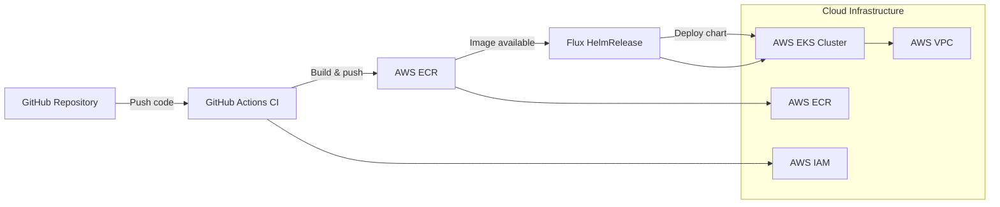

# Online Store FastAPI + Kubernetes

Python FastAPI online store application deployed with Kubernetes using Infrastructure as Code and CI/CD automation.

## Stack

- Python 3.12 + FastAPI
- Docker containerization
- AWS ECR for container registry
- AWS EKS provisioned via Terraform
- Helm chart for Kubernetes deployment
- GitHub Actions for build and publish pipelines

# Architecture Diagram



### Run locally with Python

1. Create a virtual environment:

   ```bash
   python3 -m venv .venv
   source .venv/bin/activate
   pip install -r requirements.txt
   ```

2. Run online store app:

   ```bash
   uvicorn src.app.main:app --reload --host 0.0.0.0 --port 8000
   ```

3. Visit `http://127.0.0.1:8000/docs`