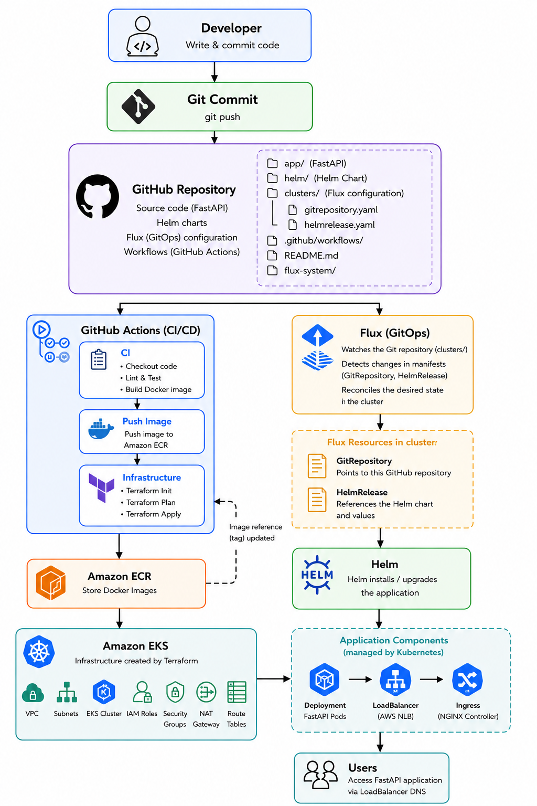

# Online Store FastAPI + Kubernetes

Python FastAPI online store application deployed with Kubernetes using Infrastructure as Code and CI/CD automation.

## Stack

- Python 3.12 + FastAPI
- Docker containerization
- AWS ECR for container registry
- AWS EKS provisioned via Terraform
- Helm chart for Kubernetes deployment
- GitHub Actions for build and publish pipelines

# High Level Architecture Diagram



## Local development

### Local prerequisites

- Docker
- Python 3.12+
- Make / bash shell
- kind
- kubectl
- helm

### Run locally with Python

1. Create a virtual environment:

   ```bash
   python3 -m venv .venv
   source .venv/bin/activate
   pip install -r requirements.txt
   ```

2. Run online store app:

   ```bash
   uvicorn src.app.main:app --reload --host 0.0.0.0 --port 8000
   ```

3. Visit `http://127.0.0.1:8000/docs`

### Run in Kind Cluster
#### (Runs as part of build and test app CI workflow)
```bash
make help
```

1. Build the Docker image:

   ```bash
   make docker-build
   ```

2. Create a kind cluster with the provided config:

   ```bash
   make kind-create
   ```

3. Load the image into kind:

   ```bash
   make kind-load
   ```

4. Install the Helm chart with the local image:

   ```bash
   make kind-deploy
   ```

5. Forward the service port:

   ```bash
   kubectl port-forward svc/online-store 8000:80
   ```

6. Open `http://127.0.0.1:8000/docs` `http://127.0.0.1:8000/products`

> To tear down the local cluster, run `make kind-clean`.

## Cloud deployment
#### (Runs as part of 'deployment' CD workflow)

### Cloud prerequisites

- AWS account with permissions for EKS, ECR, VPC, IAM, and EC2
- AWS CLI configured with `aws configure`
- Terraform 1.5+
- GitHub repository with repository secrets

### Configure GitHub Actions secrets

Add these secrets to the repository:

- `AWS_ACCESS_KEY_ID`
- `AWS_SECRET_ACCESS_KEY`
- `AWS_REGION`
- `AWS_ACCOUNT_ID`
- `ECR_REPOSITORY`
- `EKS_CLUSTER_NAME`

### Deploy infrastructure and App

1. Deploy AWS VPC, ECR, EKS:

   ```bash
   cd infra/terraform
   terraform init
   terraform apply --auto-approve
   ```

2. Configure kubectl to use the new cluster:

   ```bash
   aws eks update-kubeconfig --name $(terraform output -raw cluster_name) --region $(terraform output -raw region)
   ```

3. Verify Cluster creation:

   ```bash
   aws eks describe-cluster \
      --name <CLUSTER_NAME> \
      --region <AWS_REGION>
   ```

4. login to ECR:
   ```bash
   aws ecr get-login-password --region <AWS_REGION> | docker login --username <AWS_USER> --password-stdin <AWS_ACCOUNT_ID>.dkr.ecr.<AWS_REGION>.amazonaws.com
   ```

5. Build Tag and push image:
   ```bash
   docker build -t online-store .

   docker tag online-store:latest <AWS_ACCOUNT_ID>.dkr.ecr.<AWS_REGION>.amazonaws.com:latest

   docker push <AWS_ACCOUNT_ID>.dkr.ecr.<AWS_REGION>.amazonaws.com/online-store:latest
   ```

6. Install App Helm Chart:
   ```bash
   helm upgrade --install online-store deploy/charts/online-store --set image.repository=<AWS_ACCOUNT_ID>.dkr.ecr.<AWS_REGION>.amazonaws.com/online-store --set image.tag=latest
   ```
7. Verify and test app:

   Check helm release, deployments, and pods
   ```bash
   helm list
   kubectl get deployments
   kubectl get pod
   ```
   Verify Load Ballancer service external ip
   ```bash
   kubectl get svc online-store -o jsonpath='{.status.loadBalancer.ingress[0].hostname}

   output:
   NAME           TYPE           EXTERNAL-IP
   online-store   LoadBalancer   a1b2c3d4....

   Access app endpoint:
   http://a1b2c3d4....
   ```


