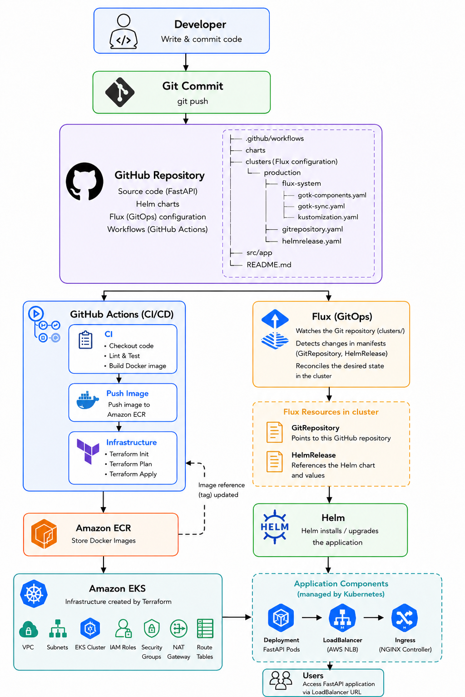

# Production DevOps Platform

Python FastAPI online store application deployed with Kubernetes and Helm using Infrastructure as Code and CI/CD automation.
This project reflects a typical DevOps deployment workflow where source code is tested and built into a Docker image, stored in Amazon ECR, and deployed to an Amazon EKS cluster using flux and helmrelease(watching ECR repo for new available app image), while AWS infrastructure is provisioned with Terraform. The repository is designed to demonstrate an end-to-end Infrastructure-as-Code and GitOps-style workflow.

## Stack

- Python 3.12 + FastAPI
- Docker containerization
- AWS ECR for container registry
- AWS EKS provisioned via Terraform
- Helm chart for Kubernetes deployment
- GitHub Actions for build and publish pipelines
- Flux CD for GitOps operations

# High Level Architecture Diagram



## Local development

### Local prerequisites

- Docker
- Python 3.12+
- Make / bash shell
- kind
- kubectl
- helm

### Run locally with Python

1. Create a virtual environment:

   ```bash
   python3 -m venv .venv
   source .venv/bin/activate
   pip install -r requirements.txt
   ```

2. Run online store app:

   ```bash
   uvicorn src.app.main:app --reload --host 0.0.0.0 --port 8000
   ```

3. Visit `http://127.0.0.1:8000/docs`

### Run in Kind Cluster
#### (Runs as part of build and test app CI workflow)
```bash
make help
```

1. Build the Docker image:

   ```bash
   make docker-build
   ```

2. Create a kind cluster with the provided config:

   ```bash
   make kind-create
   ```

3. Load the image into kind:

   ```bash
   make kind-load
   ```

4. Install the Helm chart with the local image:

   ```bash
   make kind-deploy
   ```

5. Forward the service port:

   ```bash
   kubectl port-forward svc/online-store 8000:80
   ```

6. Open `http://127.0.0.1:8000/docs` `http://127.0.0.1:8000/products`

> To tear down the local cluster, run `make kind-clean`.

## Cloud deployment AWS(manual steps)

#### (Runs as part of 'deployment' CD workflow)

### Cloud prerequisites

- AWS account with permissions for EKS, ECR, VPC, IAM, and EC2
- AWS CLI configured with `aws configure`
- Terraform 1.5+
- GitHub repository with repository secrets
- Github PAT token
- kubectl
- Helm

### Configure GitHub Actions secrets

Add these secrets to the repository:

- `AWS_ACCESS_KEY_ID`
- `AWS_SECRET_ACCESS_KEY`
- `AWS_REGION`
- `AWS_ACCOUNT_ID`
- `ECR_REPOSITORY_NAME`
- `EKS_CLUSTER_NAME`

### Deploy infrastructure and App

1. Deploy AWS VPC, ECR, EKS:

   ```bash
   cd infra/terraform
   terraform init
   terraform plan
   terraform apply --auto-approve
   ```

2. Configure kubectl to use the new cluster:

   ```bash
   aws eks update-kubeconfig --name <CLUSTER_NAME> --region <AWS_REGION>
   ```

3. Verify Cluster creation:

   ```bash
   aws eks describe-cluster \
      --name <CLUSTER_NAME> \
      --region <AWS_REGION>
   ```

4. login to ECR:
   ```bash
   aws ecr get-login-password --region <AWS_REGION> | docker login --username <AWS_USER> --password-stdin <AWS_ACCOUNT_ID>.dkr.ecr.<AWS_REGION>.amazonaws.com
   ```

5. Build Tag and push image:

   ```bash
   docker build -t online-store .

   docker tag online-store:latest <AWS_ACCOUNT_ID>.dkr.ecr.<AWS_REGION>.amazonaws.com/online-store:latest

   docker push <AWS_ACCOUNT_ID>.dkr.ecr.<AWS_REGION>.amazonaws.com/online-store:latest
   ```

6. Install Flux:

   ```bash
   curl -s https://fluxcd.io/install.sh | sudo bash
   ```

7. Create ecr-config secret used by helmrelease:

   ```bash
   kubectl create secret generic ecr-config \
      -n default \
      --from-literal=repository=<ECR_REPOSITORY_URL>
   ```

8. Bootstrap Flux Git repo:

   How to create PAT token can be found here: [github docs](https://docs.github.com/en/authentication/keeping-your-account-and-data-secure/managing-your-personal-access-tokens#creating-a-fine-grained-personal-access-token)

   ```bash
    export GITHUB_TOKEN: <GitHub PAT>

    flux bootstrap github \
      --owner=<owner-name> \
      --repository=<repository-name> \
      --branch=main \
      --path=clusters/production \
      --personal
   ```
   ```bash
   Verify Flux
      $ flux check
   ```

9. Reconcile:
   ```bash
    flux reconcile source git online-store-repo --namespace flux-system
    flux reconcile kustomization flux-system --with-source
   ```
   NOTE: The bootstrap process already creates the initial GitRepository and Kustomization and starts reconciliation. You'd only use flux reconcile later if you wanted to force an immediate sync after making changes

10. Validate the Flux resources:

   ```bash
   flux get sources git
   flux get helmreleases
   kubectl api-resources | grep HelmRelease
   ```

11. Verify and test app:

   Check helm release, deployments, and pods
   ```bash
   helm list
   kubectl get deployments
   kubectl get pod
   ```
   Verify Load Ballancer service external ip
   ```bash
   kubectl get svc online-store
   
   output:
   NAME           TYPE           CLUSTER-IP      EXTERNAL-IP                                                              PORT(S)        AGE
   online-store   LoadBalancer   172.20.137.83   a72ab2ca2c7d840cc821324981d3265b-849734734.us-east-1.elb.amazonaws.com   80:30370/TCP   103s

   Access app endpoint to view landing page(See images/app-landing-page.png):
   http://a72ab2ca2c7d840cc821324981d3265b-849734734.us-east-1.elb.amazonaws.com

   Access API docs
   http://a72ab2ca2c7d840cc821324981d3265b-849734734.us-east-1.elb.amazonaws.com/docs
   ```


