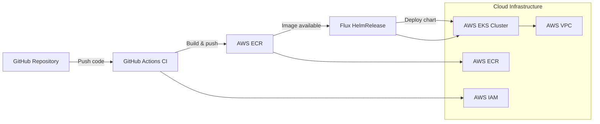

# Online Store FastAPI + Kubernetes

Python FastAPI online store application deployed with Kubernetes using Infrastructure as Code and CI/CD automation.

## Stack

- Python 3.12 + FastAPI
- Docker containerization
- AWS ECR for container registry
- AWS EKS provisioned via Terraform
- Helm chart for Kubernetes deployment
- GitHub Actions for build and publish pipelines

# Architecture Diagram

