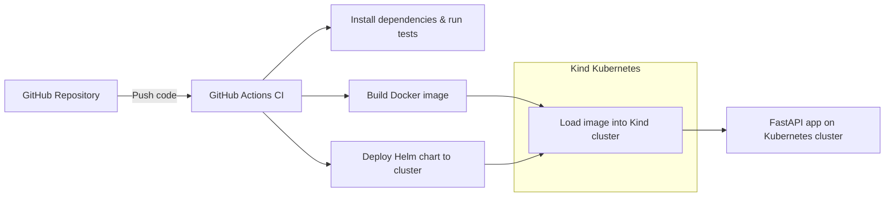

# Online Store FastAPI + Kubernetes

Python FastAPI online store application deployed with Kubernetes using Infrastructure as Code and CI/CD automation.

## Stack

- Python 3.12 + FastAPI
- Docker containerization
- AWS ECR for container registry
- AWS EKS provisioned via Terraform
- Helm chart for Kubernetes deployment
- GitHub Actions for build and publish pipelines

# Current Architecture Diagram


## Local development

### Local prerequisites

- Docker
- Python 3.12+
- Make / bash shell
- kind
- kubectl
- helm

### Run locally with Python

1. Create a virtual environment:

   ```bash
   python3 -m venv .venv
   source .venv/bin/activate
   pip install -r requirements.txt
   ```

2. Run online store app:

   ```bash
   uvicorn src.app.main:app --reload --host 0.0.0.0 --port 8000
   ```

3. Visit `http://127.0.0.1:8000/docs`

### Run in Kind Cluster
#### (Runs as part of build and test app CI workflow)
```bash
make help
```

1. Build the Docker image:

   ```bash
   make docker-build
   ```

2. Create a kind cluster with the provided config:

   ```bash
   make kind-create
   ```

3. Load the image into kind:

   ```bash
   make kind-load
   ```

4. Install the Helm chart with the local image:

   ```bash
   make kind-deploy
   ```

5. Forward the service port:

   ```bash
   kubectl port-forward svc/online-store 8000:80
   ```

6. Open `http://127.0.0.1:8000/docs` `http://127.0.0.1:8000/products`

> To tear down the local cluster, run `make kind-clean`.